**Three-Tier Web Application Architecture (Spring PetClinic)**

**Section 1: Project Overview**

This project implements a **Three-Tier Web Application Architecture** on
Amazon Web Services (AWS). The architecture follows industry best
practices, focusing on **security, scalability, and fault tolerance**.
The deployed application is **Spring PetClinic**, a popular open-source
Java web application that simulates a veterinary clinic management
system.

The three tiers are:

1.  **Presentation Tier (Web Layer)**

    -   Hosted on a **public-facing Application Load Balancer (ALB)**.

    -   Receives HTTP requests from users.

    -   For testing purposes, a **public EC2 instance** was temporarily
        used, but the final design relies on the ALB.

2.  **Application Tier (Business Logic Layer)**

    -   Runs the **Spring PetClinic Java application** on a **private
        EC2 instance**.

    -   This instance is not directly exposed to the internet for
        security reasons.

    -   It communicates only with the database tier and the load
        balancer.

3.  **Database Tier (Data Layer)**

    -   Uses an **Amazon RDS (MySQL) instance**.

    -   The database is deployed in **private subnets** for maximum
        security.

    -   Accessible only from the application tier EC2.

**Why This Architecture?**

-   **Security by design**:

    -   The database never faces the internet.

    -   The application tier sits in private subnets, isolated from
        direct user access.

    -   NAT Gateway allows private EC2 instances to download packages
        without exposing them publicly.

-   **Scalability**:

    -   The Application Load Balancer (ALB) can distribute traffic
        across multiple private EC2 instances if scaled horizontally.

-   **Resilience**:

    -   By spreading resources across multiple Availability Zones, the
        application can withstand zone failures.

**Main AWS Services Used**

1.  **VPC (Virtual Private Cloud)** -- Custom networking environment.

2.  **Subnets** -- Both **public** and **private** subnets.

3.  **Internet Gateway (IGW)** -- Provides internet access for
    public-facing resources.

4.  **NAT Gateway** -- Enables private EC2 instances to access the
    internet for updates.

5.  **Route Tables** -- Configured to manage traffic flow between
    subnets, NAT, and IGW.

6.  **Security Groups** -- Virtual firewalls for EC2 and RDS instances.

7.  **EC2 Instances** -- Compute layer for application and
    bastion/testing.

8.  **RDS (MySQL)** -- Managed relational database service.

9.  **Elastic Load Balancer (ALB)** -- Distributes web traffic to
    backend EC2 instances.

**End Goal**

-   Deploy the **Spring PetClinic app** inside a **private EC2
    instance**.

-   Configure it to connect securely to the **RDS MySQL database**.

-   Expose the application safely via an **Application Load Balancer**.

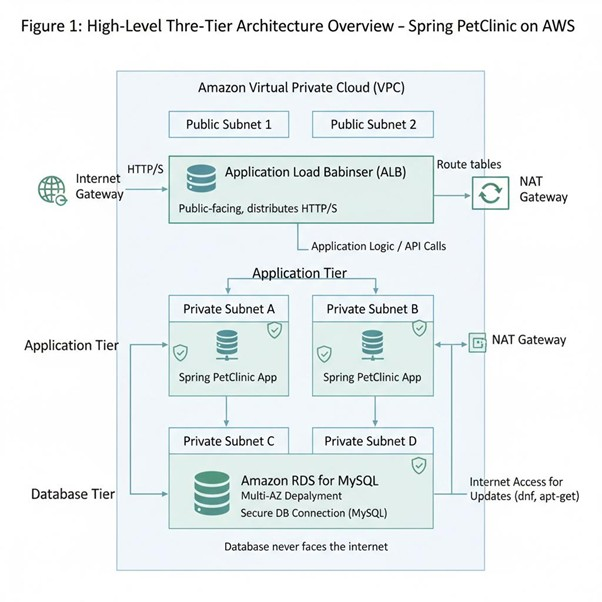

**Section 2: Architecture Design -- VPC, Subnets, Routing, and Core
Networking**

To securely deploy the three-tier application, we first built a **custom
Virtual Private Cloud (VPC)**. This is the foundation of the project
because all other resources (EC2, RDS, Load Balancer, NAT Gateway)
depend on the network design.

**2.1 VPC Creation**

-   A **custom VPC** was created instead of using the default one.

-   CIDR block chosen:

-   10.0.0.0/16

This provides up to **65,536 private IPs**, enough to carve into
multiple subnets across AZs.


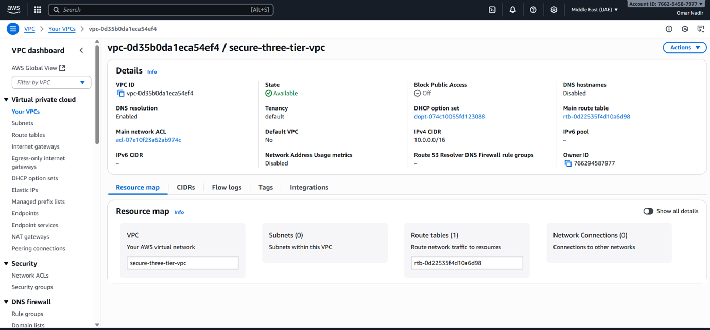


**2.2 Subnet Design**

We divided the VPC into **public and private subnets** across **two
Availability Zones (AZs)** for high availability.

-   **Public Subnets**

    -   Subnet A: 10.0.1.0/24 (AZ1)

    -   Subnet B: 10.0.2.0/24 (AZ2)

    -   Hosts: Load Balancer + NAT Gateway + Bastion/Test EC2

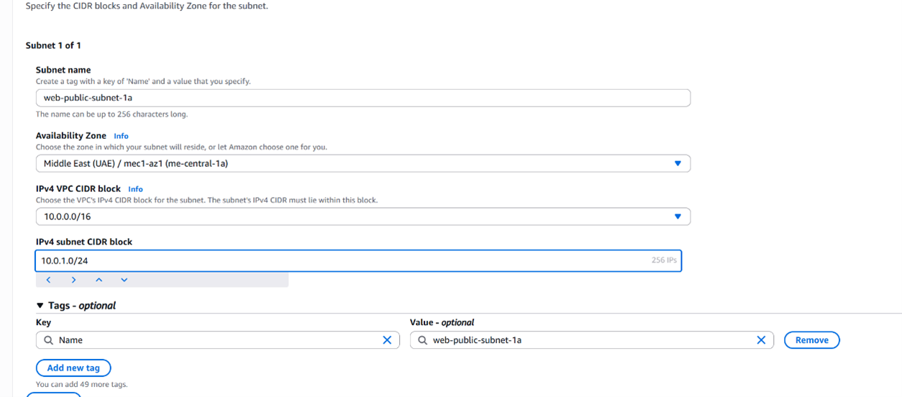


-   **Private Subnets (App Layer)**

    -   Subnet C: 10.0.3.0/24 (AZ1)

    -   Subnet D: 10.0.4.0/24 (AZ2)

    -   Hosts: Application EC2 (Spring PetClinic)

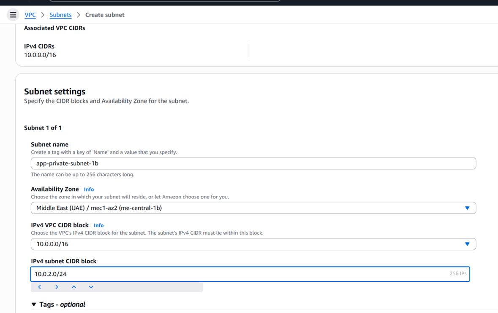

   **Private Subnets (DB Layer)**

    -   Subnet E: 10.0.5.0/24 (AZ1)

    -   Subnet F: 10.0.6.0/24 (AZ2)

    -   Hosts: Amazon RDS (MySQL)

This way, even if **one AZ fails**, traffic automatically shifts to the
other.

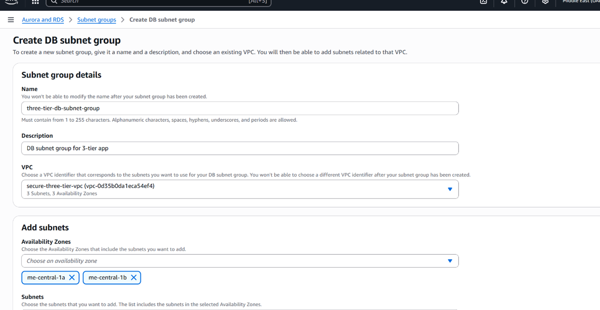

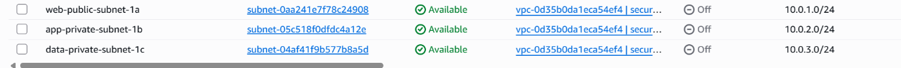


**2.3 Internet Gateway (IGW)**

-   An **Internet Gateway** was attached to the VPC to enable internet
    connectivity for **public subnets**.

-   Without this, EC2s in public subnets wouldn't be reachable from
    outside.

Command:
```bash
aws ec2 create-internet-gateway

aws ec2 attach-internet-gateway \--vpc-id vpc-xxxx
\--internet-gateway-id igw-xxxx
```

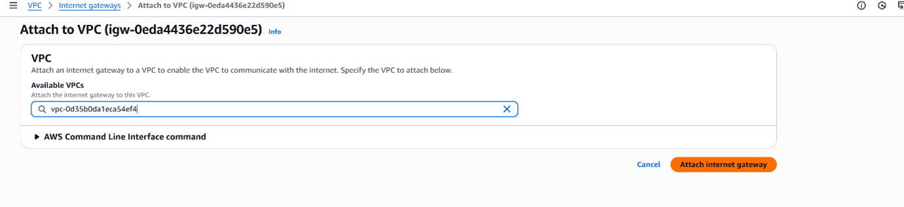

**2.4 NAT Gateway**

-   Private EC2 instances (like the app server) need internet access to:

    -   Install system updates.

    -   Download dependencies (Maven, Java packages).

-   A **NAT Gateway** was created in each **public subnet**, one per AZ.

-   Elastic IPs were attached to NAT Gateways.

Routing rule:

-   Private subnets route outbound traffic to NAT Gateway → NAT forwards
    to Internet Gateway → internet.

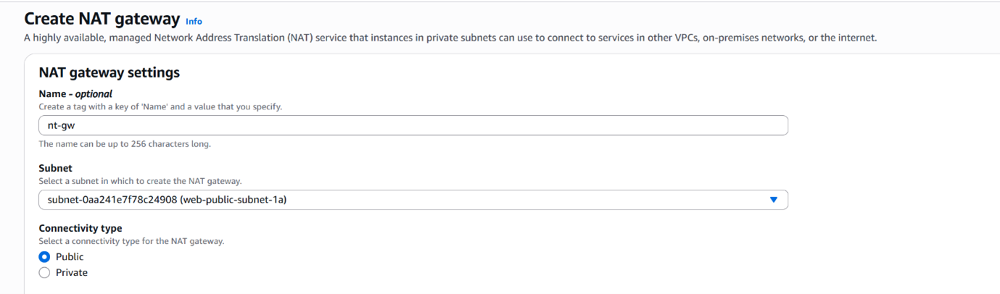

**2.5 Route Tables**

We set up **different route tables** for public and private subnets:

-   **Public Route Table**:

    -   Route to **Internet Gateway (IGW)** for 0.0.0.0/0.

    -   Associated with Public Subnets A & B.

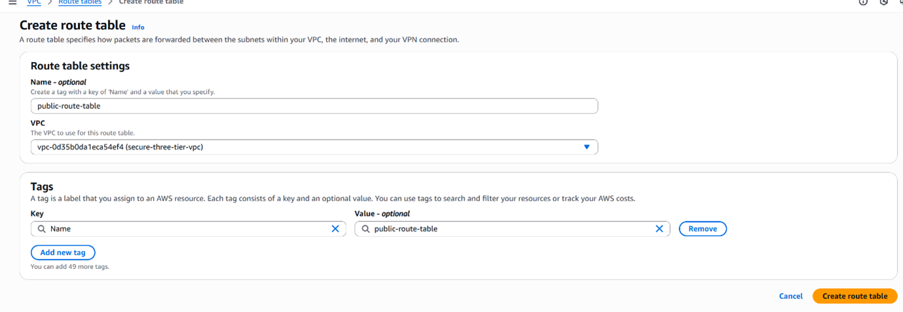

-   **Private App Route Table**:

    -   Route to **NAT Gateway** for 0.0.0.0/0.

    -   Associated with Subnets C & D (Application Tier).

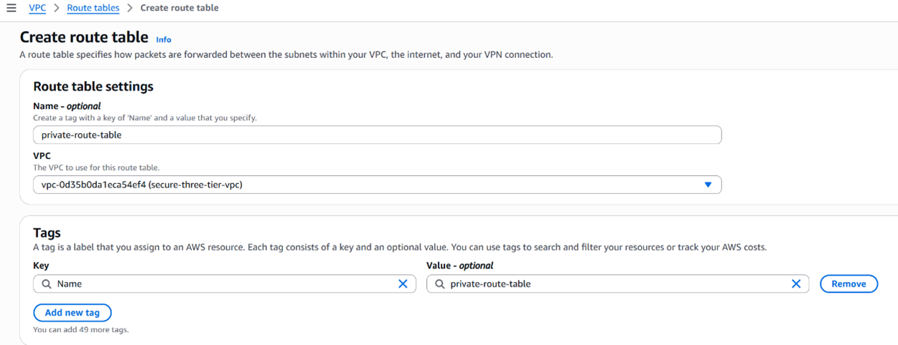

-   **Private DB Route Table**:

    -   No internet access.

    -   Only internal communication within VPC.

    -   Associated with Subnets E & F (Database Tier).


**2.6 Security Groups**

Security groups act like **firewalls** at the instance level.

-   **Web ec2 SG**

    -   Inbound: Allow HTTP (80), HTTPS (443) from anywhere, SSH from my
        IP

    -   Outbound: Allow all traffic to App EC2 SG.

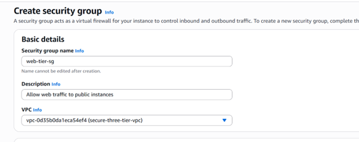

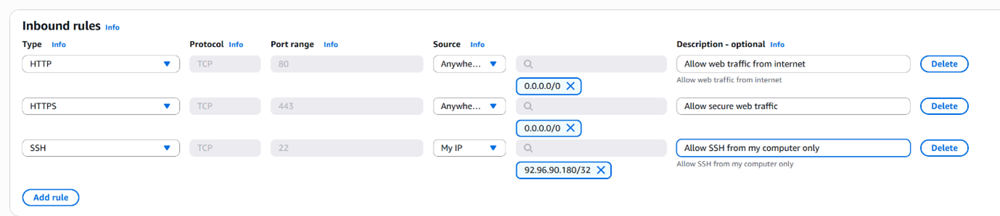


-   **Load Balancer SG**

    -   Inbound: Allow HTTP (80), HTTPS (443) from anywhere.

    -   Outbound: Allow all traffic to App EC2 SG.

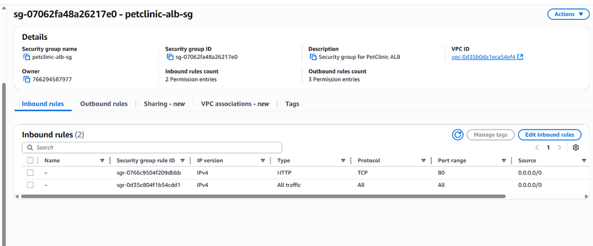

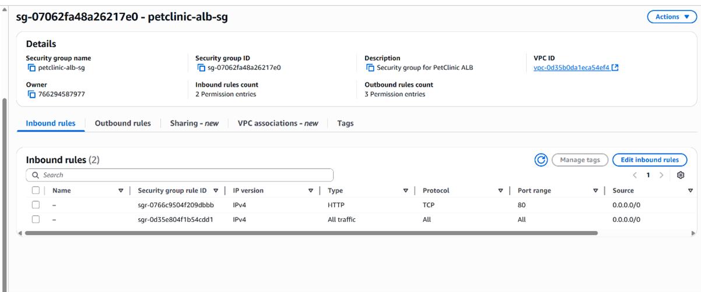


-   **App EC2 SG**

    -   Inbound: Allow HTTP (8080) only from Load Balancer SG.

    -   Outbound: Allow MySQL (3306) to DB SG.

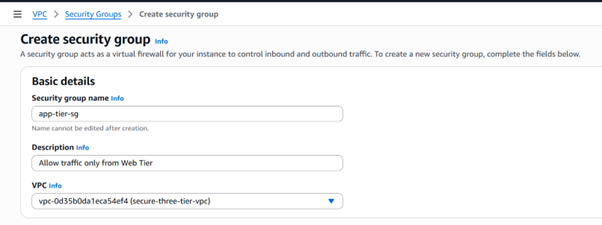
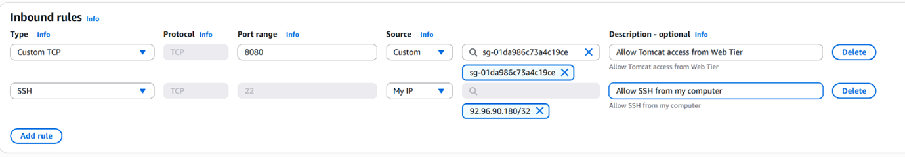

-   **Database SG**

    -   Inbound: Allow MySQL (3306) only from App EC2 SG.

    -   Outbound: Restricted to internal VPC traffic.

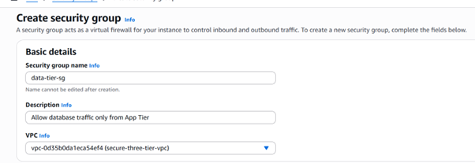

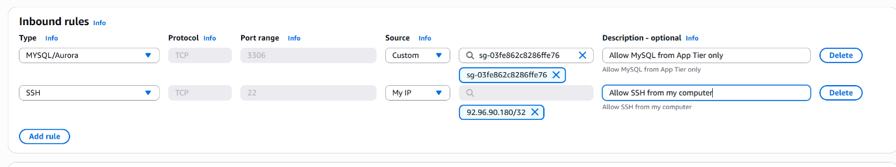


**2.7 Network Flow Recap**

1.  **User** → Browser → **ALB (Public Subnet)**

2.  **ALB** → forwards traffic → **App EC2 (Private Subnet)**

3.  **App EC2** → queries → **RDS MySQL (Private DB Subnet)**

4.  Responses flow back through the same path.

This ensures:

-   **No direct access** to app or DB from the internet.

-   **Only the ALB** is exposed publicly.

-   **Least privilege principle** is enforced at every level.

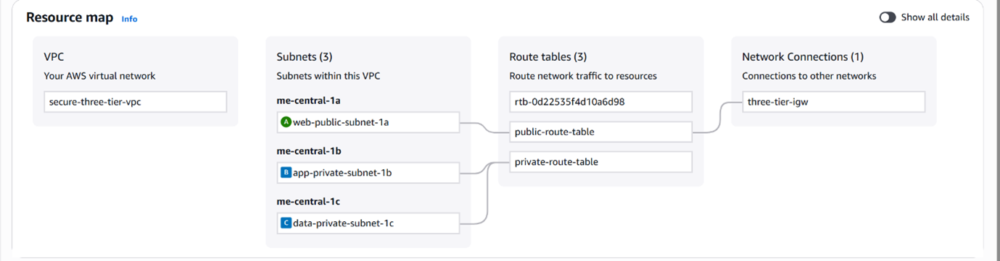


**Section 3: Provisioning EC2 Instances and Installing Dependencies**

The application tier of our project is powered by **EC2 instances**
running inside **private subnets**. These hosts run the **Spring
PetClinic application** and communicate with the database (RDS).

Since they're in private subnets, they cannot be accessed directly from
the internet. Instead, all management was done via **bastion/SSH jump
from public subnet** or **SSM Session Manager**.

**3.1 Launching the Public EC2 Instances**

-   **AMI used**: Ubuntu Server 22.04 LTS (free tier eligible).

-   **Instance type**: t3.medium (enough CPU & RAM for Maven build and
    Java app).

-   **Subnet**: Public Subnet C (10.0.3.0/24).

-   **Auto-assign Public IP**: enabled

-   **Security Group**: web EC2 SG

**Steps in AWS Console:**

1.  Go to **EC2 → Launch Instance**.

2.  Select **Ubuntu 22.04** AMI.

3.  Choose **t3.medium** type.

4.  Place inside **public Subnet A**.

5.  Enabled Public IP.

6.  Attach the **App EC2 Security Group**.

7.  Add IAM Role if needed (for SSM access).

8.  Launch the instance.

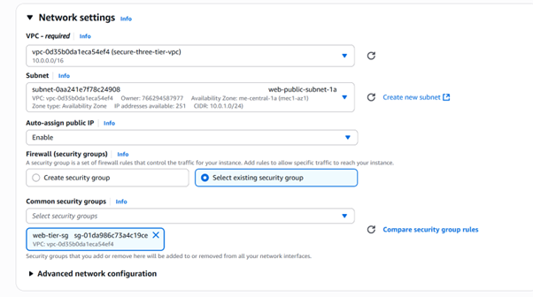

**3.1 Launching the Private EC2 Instances**

-   **AMI used**: Ubuntu Server 22.04 LTS (free tier eligible).

-   **Instance type**: t3.medium (enough CPU & RAM for Maven build and
    Java app).

-   **Subnet**: Private Subnet C (10.0.3.0/24).

-   **Auto-assign Public IP**: Disabled (because it's private).

-   **Security Group**: App EC2 SG (only allows traffic from ALB and to
    DB).

**Steps in AWS Console:**

9.  Go to **EC2 → Launch Instance**.

10. Select **Ubuntu 22.04** AMI.

11. Choose **t3.medium** type.

12. Place inside **Private Subnet C**.

13. Disable Public IP.

14. Attach the **App EC2 Security Group**.

15. Add IAM Role if needed (for SSM access).

16. Launch the instance.

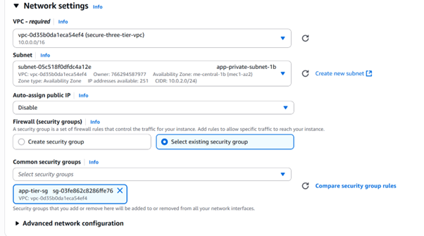


**3.2 Connecting to Private EC2**

Since the instance is private, we used one of two methods:

1.  **Through Bastion Host (in Public Subnet):**

2.  ssh -i mykey.pem ubuntu@\<Bastion-Public-IP\>

3.  ssh ubuntu@\<Private-EC2-Private-IP\>

4.  **Via AWS SSM Session Manager:**\
    If IAM role with AmazonSSMManagedInstanceCore was attached:

    -   Open **AWS Systems Manager → Session Manager → Start Session**.

    -   Directly open shell into private EC2.

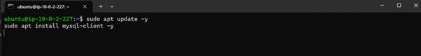

**3.3 Updating the System**

Once inside the private EC2:
```bash
sudo apt update -y

sudo apt upgrade -y
```

This ensures all system packages are up to date.

**3.4 Installing Java (OpenJDK 17)**

Spring PetClinic requires Java 17.
```bash
sudo apt install openjdk-17-jdk -y
java -version
```
Expected output:

**3.5 Installing Git and Maven**

We needed both **Git** (to clone the PetClinic repo) and **Maven** (to
build the project).

```bash
sudo apt install git maven -y
git \--version
mvn -v
```

Expected output:

-   Git version (e.g., 2.34.1)

-   Apache Maven version (3.8.x)

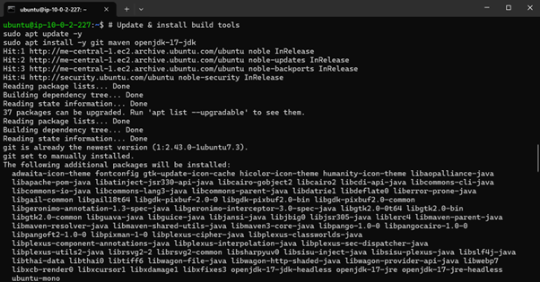


**3.6 Cloning the Spring PetClinic Repository**

Navigate to /opt and clone the official repo:

```bash
cd /opt
sudo git clone https://github.com/spring-projects/spring-petclinic.git
cd spring-petclinic
```

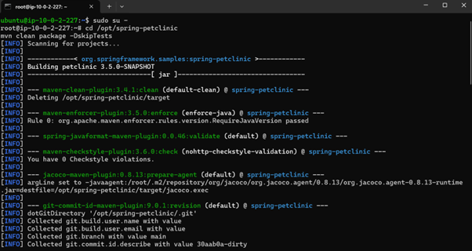


**3.7 Building the Application**

We then packaged the application into a .jar file:
```bash
sudo mvn package
```
-   Maven downloaded dependencies (this took a while).

-   At the end, the .jar file was generated inside the target directory.

Navigate to target folder:
```bash
cd target
ls
```

Expected output:

spring-petclinic-3.5.0-SNAPSHOT.jar


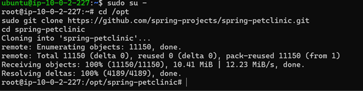


**3.8 Running the Application**

Run the application on port 8080:

```bash
sudo java -jar spring-petclinic-3.5.0-SNAPSHOT.jar
```

At this point:

-   Spring Boot started an **embedded Tomcat server**.

-   Logs showed:

-   Tomcat started on port(s): 8080 (http)

Started PetClinicApplication in XX seconds


**3.8 Running the Application**

Run the application on port 8080:

```bash
sudo java -jar spring-petclinic-3.5.0-SNAPSHOT.jar
```

At this point:

-   Spring Boot started an **embedded Tomcat server**.

-   Logs showed:

-   Tomcat started on port(s): 8080 (http)

-   Started PetClinicApplication in XX seconds

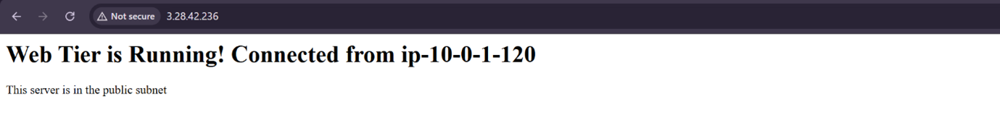


**3.9 Verifying Application Service**

We verified that the application was listening:
```bash
sudo ss -tulnp \| grep 8080
```
Output:

tcp LISTEN 0 100 \*:8080 \*:\* users:((\"java\",pid=1261,fd=9))

This confirmed PetClinic was running on **port 8080**.

**3.10 Making it Run in Background (Optional)**

Instead of tying up the SSH session, we could run it as a background
process:
```bash
nohup sudo java -jar spring-petclinic-3.5.0-SNAPSHOT.jar \>
petclinic.log 2\>&1 &
```
-   nohup → makes process immune to logout.

-   & → runs in background.

-   Logs stored in petclinic.log.

Check running process:
```bash
ps aux \| grep spring-petclinic
```


**Section 4: Database Setup with Amazon RDS (MySQL)**

The database tier is hosted in **Amazon RDS for MySQL**, which provides
a managed, scalable relational database service. Unlike running MySQL on
EC2, RDS handles backups, patching, and replication automatically.


**4.1 Creating a Security Group for RDS**

Before launching the database, we need a **DB Security Group** to
control traffic.

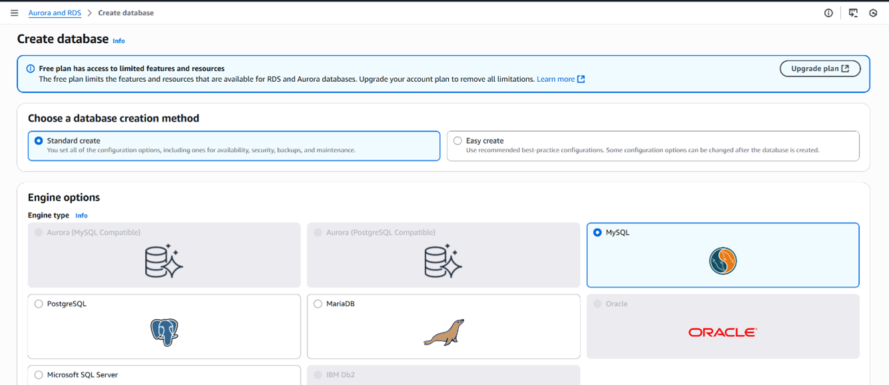

1.  Go to **EC2 → Security Groups → Create Security Group**.

2.  Name: RDS-SG.

3.  Inbound Rules:

    -   **MySQL/Aurora (3306)**

    -   Source: App-EC2-SG (so only app servers can connect).

4.  Outbound: Allow all (default).

> **4.2 Creating the RDS Instance**
>
> Steps inside **AWS Console**:

1.  Navigate to **RDS → Databases → Create Database**.

2.  Choose **Standard Create**.

3.  Engine: **MySQL (8.0.x)**.

4.  Template: **Free Tier** (for cost saving).

5.  DB Identifier: three-tier-db.

6.  Credentials:

    -   Master username: admin.

    -   Master password: yourpassword.

7.  Instance type: db.t3.micro.

8.  Storage: 20 GB (gp2).

9.  Connectivity:

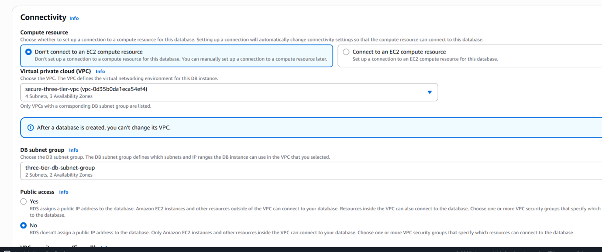

-   VPC: Three-Tier-VPC.

-   Subnet group: Select **Private Subnets**.

-   Public access: **No**.

-   Security group: Attach **RDS-SG**.

10. Additional settings:

    -   Initial DB name: petclinic.

11. Click **Create Database**.

> Wait \~10 minutes for the RDS instance to be available.

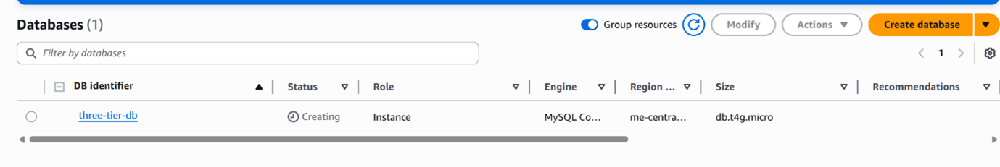

> **4.3 Verifying Connectivity from Private EC2**
> Once RDS was created, we tested the connection from our **private
> EC2** where PetClinic is running.

1.  Install MySQL client:

2. 
```bash
 sudo apt install mysql-client -y
```
3.  Test connection:
```bash
 nc -vz three-tier-db.clmaggewmy20.me-central-1.rds.amazonaws.com
    3306
```

> Expected output:
4.  Log in to MySQL:
```bash
 mysql -h three-tier-db.clmaggewmy20.me-central-1.rds.amazonaws.com
    -u admin -p
```

> Enter the password. You should see the MySQL shell:
>
> mysql\>


 **4.4 Creating the Database Schema**

> Inside MySQL shell:
>
> CREATE DATABASE petclinic;
>
> SHOW DATABASES;
>

**4.5 Configuring Spring PetClinic to Use RDS**

> The PetClinic app by default uses an **in-memory H2 database** (not
> persistent). To connect it to MySQL, we edited the
> **application.properties** file.

1.  Navigate to resources folder:
```bash
 cd /opt/spring-petclinic/src/main/resources/
```
2.  Edit the configuration:
```bash
sudo nano application.properties
```
3.  Add the following lines:
```bash
spring.datasource.url=jdbc:mysql://three-tier-db.clmaggewmy20.me-central-1.rds.amazonaws.com:3306/petclinic
spring.datasource.username=admin
spring.datasource.password=yourpassword
spring.datasource.driver-class-name=com.mysql.cj.jdbc.Driver
spring.jpa.hibernate.ddl-auto=update
spring.jpa.show-sql=true
```

13. Save and exit (CTRL+O, CTRL+X).

 **Section 5: Load Balancer Setup (Application Load Balancer - ALB)**

> We used an **Application Load Balancer (ALB)** because:

-   It supports **HTTP/HTTPS** (Layer 7).

-   It can do **health checks** to only send traffic to healthy EC2s.

-   It scales automatically across multiple Availability Zones.

 **5.1 Security Group for the ALB**

Before creating the ALB, we needed a Security Group that allowed
 **public access**.

1.  Go to **EC2 → Security Groups → Create Security Group**.

2.  Name: alb-sg.

3.  Inbound Rules:

    -   HTTP (80) → Source: 0.0.0.0/0

    -   (Optional) HTTPS (443) → Source: 0.0.0.0/0

4.  Outbound: Allow all traffic (default).

 **5.2 Creating the Target Group**

 A **Target Group** is required to tell the ALB where to send traffic
 (our app EC2).

1.  Go to **EC2 → Target Groups → Create Target Group**.

2.  Choose: **Instances**.

3.  Name: petclinic-tg.

4.  Protocol: **HTTP**.

5.  Port: **8080** (because PetClinic runs on 8080).

6.  VPC: Three-Tier-VPC.

7.  Health Check settings:

    -   Protocol: HTTP

    -   Path: / (PetClinic home page responds on /).

    -   Port: Traffic Port (8080).

    -   Success codes: 200 (OK).

    -   Healthy threshold: 2.

    -   Unhealthy threshold: 2.

    -   Timeout: 5s.

    -   Interval: 10s.

8.  Register Targets:

    -   Select the **Private EC2** instance running PetClinic.

    -   Port: 8080.

    -   Click **Add to registered**.

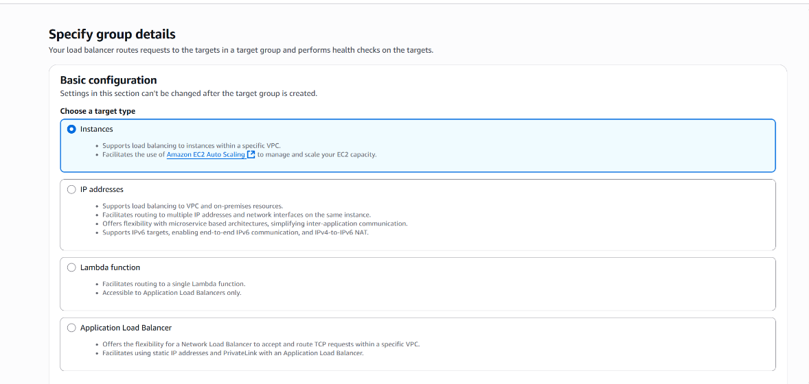

**5.3 Creating the Application Load Balancer**

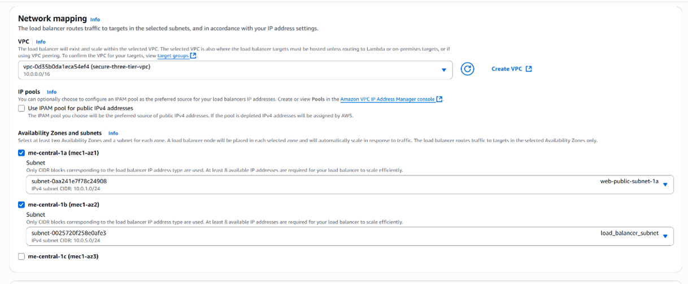

Now we expose the app to the public through the ALB.

1.  Go to **EC2 → Load Balancers → Create Load Balancer**.

2.  Select **Application Load Balancer**.

3.  Name: petclinic-alb.

4.  Scheme: **Internet-facing**.

5.  IP address type: **IPv4**.

6.  Network Mapping:

    -   VPC: Three-Tier-VPC.

    -   Subnets: Select **2 Public Subnets** in different Availability
        Zones (required by ALB).

7.  Security Group: Select alb-sg.

8.  Listeners:

    -   Add HTTP:80 → Forward to petclinic-tg.

> Click **Create Load Balancer**.

 **5.4 Verifying the ALB Health Checks**

 After a few minutes, check **Target Group → Targets tab**.

-   Status should show **healthy**

-   If it shows **unhealthy**:

    -   Confirm PetClinic is running on port 8080 (sudo lsof -i :8080).

    -   Confirm inbound SG rule of EC2 allows 8080 traffic **from ALB
        SG**.

    -   Confirm health check path / is valid.

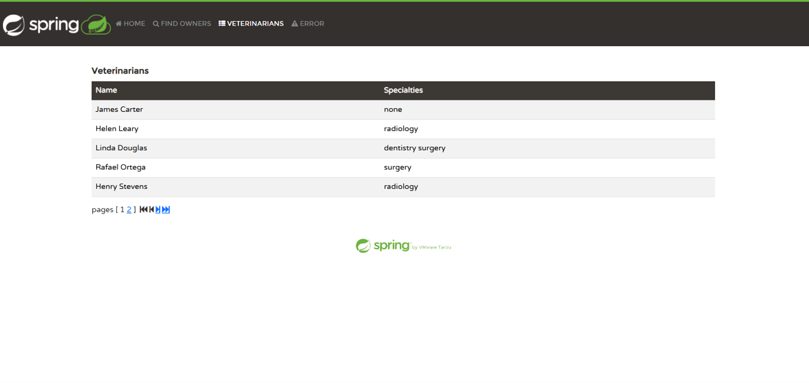


 **5.5 Accessing the Application**

 Once targets are healthy:

1.  Copy the ALB DNS name from the console, e.g.:

2.  petclinic-alb-123456789.me-central-1.elb.amazonaws.com

3.  Open it in browser:

4.  http://petclinic-alb-123456789.me-central-1.elb.amazonaws.com

5.  You should see the **Spring PetClinic home page**.

**5.6 Troubleshooting (If Needed)**

Sometimes ALB may fail. Here's how we handled it:

1.  **502 Bad Gateway** → Usually means ALB can't reach the target.

    -   Fix: Ensure EC2 SG allows inbound 8080 **from ALB SG**.

2.  **Health check unhealthy** →

    -   Fix: Confirm PetClinic responds on /. If app is on a different
        path (e.g. /petclinic), update health check path

 **Section 6: NAT Gateway and Internet Access for Private EC2**

 In a multi-tier architecture, the **private EC2** cannot access the
 internet directly because it is in a **private subnet**. However, we
 need it to:

-   Install packages (apt-get update, Maven, Git).

-   Pull source code from GitHub.

-   Download dependencies for Spring Boot.

 The solution is a **NAT Gateway**, which allows outbound traffic from
 private instances while keeping them unreachable from the internet.

 **6.1 Create an Elastic IP (EIP)**

 A NAT Gateway requires an Elastic IP to provide a public IP for
 outbound connections.

1.  Go to **VPC → Elastic IPs → Allocate Elastic IP address**.

2.  Allocate the IP in your region (me-central-1).

3.  Note down the EIP for NAT Gateway creation.

 **6.2 Create a NAT Gateway**

1.  Go to **VPC → NAT Gateways → Create NAT Gateway**.

2.  Name: PrivateSubnet-NAT-GW.

3.  Subnet: Choose **Public Subnet** (must be public so NAT has internet
    access).

4.  Elastic IP: Select the one created in step 6.1.

5.  Click **Create NAT Gateway**.

**6.3 Update the Route Table for the Private Subnet**

 To send private subnet traffic through NAT Gateway:

1.  Go to **VPC → Route Tables → Private Subnet Route Table**.

2.  Select **Routes → Edit routes → Add route**:

    -   Destination: 0.0.0.0/0

    -   Target: nat-xxxxxxxx (your NAT Gateway ID)

3.  Save changes.

 Now all outbound internet traffic from the private subnet goes through
 the NAT Gateway.

 **6.4 Verify Private EC2 Internet Access**

 SSH into the private EC2 and run:

 ping -c 4 google.com

 or

 ``` sudo apt-get update```

 If it succeeds:

-   NAT Gateway is configured correctly.

-   Private EC2 can download packages and pull code.

> **6.5 Security Group Considerations**

-   **Private EC2 SG**:

    -   Allow inbound traffic **only from ALB SG** (port 8080).

    -   Outbound: Allow all (0.0.0.0/0) to use NAT Gateway.

-   **NAT Gateway**: No SG required (managed by AWS).

 **6.6 Testing Application Dependencies**

 After NAT Gateway setup, you can:

1.  Install Maven and JDK (if not installed):

```bash
 sudo apt-get update

 sudo apt-get install openjdk-17-jdk maven -y
```

2.  Clone PetClinic repository:
```bash
sudo git clone https://github.com/spring-projects/spring-petclinic.git
/opt/spring-petclinic
```
3.  Build the app:

```bash

 cd /opt/spring-petclinic

 sudo mvn package

 cd target

 sudo java -jar spring-petclinic-3.5.0-SNAPSHOT.jar
```

4.  Verify the private EC2 serves PetClinic on port 8080 (health check
    for ALB).

**Section 9: Final Verification, Screenshots, and Documentation Tips**

 This section ensures that the **multi-tier PetClinic project** is
 fully functional and ready for deployment verification. It also
 provides a framework for capturing screenshots and adding them to the
 documentation for non-IT readers.

 **9.1 Verify PetClinic Application on Private EC2**

1.  SSH into **private EC2**:
```bash
 ssh -i your-key.pem ubuntu@\<private-ec2-ip\>
```
2.  Check if the PetClinic app is running:
```bash
ps aux \| grep spring-petclinic
```
-  **Expected Output:** A Java process with
    spring-petclinic-3.5.0-SNAPSHOT.jar should appear.

3.  Verify the app is listening on port 8080:
```bash
> sudo ss -tulpn \| grep 8080
```
-   **Expected Output:** java process should show LISTEN on \*:8080.


 **9.2 Verify RDS Connectivity**

1.  From private EC2, test MySQL connection to RDS:
```bash
 nc -vz \<rds-endpoint\> 3306
```
-   **Expected Output:** Connection to \<rds-endpoint\> 3306 port
    \[tcp/mysql\] succeeded!

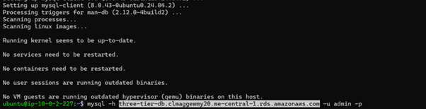


2.  Optional: Verify database credentials and schema:
```sql
> mysql -h \<rds-endpoint\> -u \<db-username\> -p
>
> SHOW DATABASES;
>
> USE \<petclinic-db\>;
>
> SHOW TABLES;
```
**9.3 Verify Load Balancer Connectivity**

1.  Access **ALB DNS name** in a browser:

> http://petclinic-alb-public-1234567890.us-east-1.elb.amazonaws.com

-   **Expected Result:** PetClinic homepage loads.

2.  Test other pages:

    -   /owners/find → search owners

    -   /vets.html → view veterinarians

    -   /oups → triggers error page

 **9.4 Verify Target Group Health Checks**

1.  Go to **EC2 → Target Groups → petclinic-tg → Targets**.

2.  Status should be **healthy** (green).

3.  If unhealthy:

    -   Verify **security group** of private EC2 allows traffic from ALB
        SG on port 8080.

    -   Verify **application is running**.

    -   Verify **health check path** is /.

 **9.5 Security Verification**

-   **ALB Security Group:** Allows HTTP/HTTPS from anywhere.

-   **Private EC2 Security Group:** Allows HTTP from ALB SG only, SSH
    from your IP.

-   **RDS Security Group:** Allows MySQL from private EC2 only.

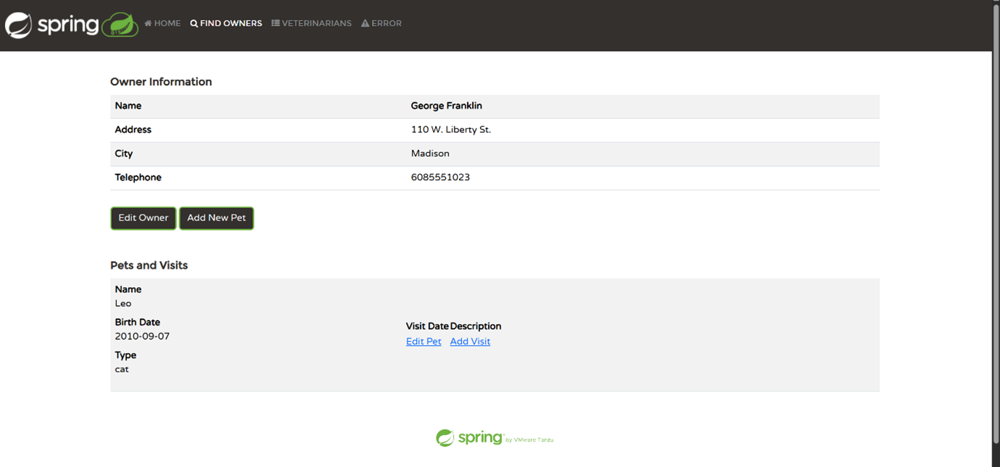
